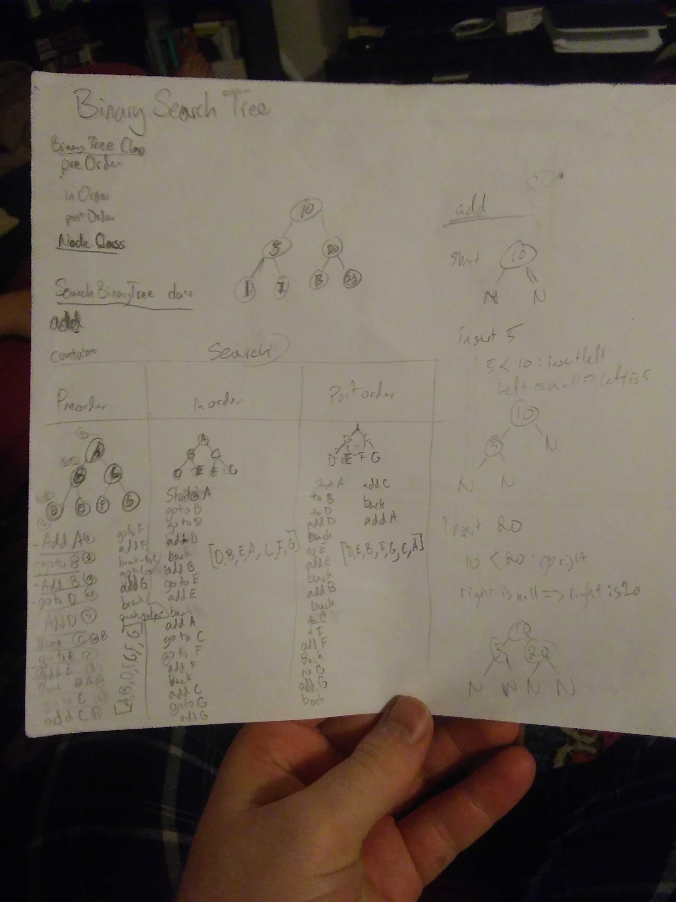
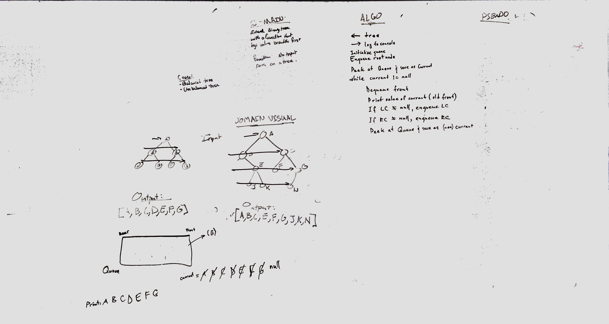

# DSA PetShelter
DSA 2: Stacks and Queues
March 30, 2019

[pull request](https://github.com/abferris/data-structures-and-algorithms/pull/42)  
[Travis](https://travis-ci.com/abferris/data-structures-and-algorithms)
## Challenge 1

* Create A Binary Tree Class
  * function preOrder
  * function inOrder
  * function postOrder
* Create A Binary Search Tree
  * has add value and puts a value in the place of a binary search tree
  * has contains, which returns boolean if they do or don't contain the value

## Approach 
* NOTE: I have issues with the traversals
* Below are the whiteboards planning how to do this.

## Challenge 2

* Create breadth search method on the Binary Tree Class
  * takes in no values
  * runs on the tree
  * gives back the values breadth first, row by row

## Approach
* Below is the whiteboard plannign to do this
* Steps
  * Utilize a queue.
  * Enqueue the root.
  * enqueue the root's left and right child if they exist
  * output or push to an output array the value at the head of the queue
  * dequeue the head.
  * continue until your queue is empty
  * if you did not output in your loop, return the output array

### Tests
#### Challenge 1  
##### Binary Tree and BST
[x] Can successfully instantiate an empty tree  
[x] Can successfully instantiate a tree with a single root node  
[x] Can successfully add a left child   
[x] Can successfully add right child  
[x] Can successfully return a collection from a preorder traversal  
[x] Can successfully return a collection from an inorder traversal  
[ ] Can successfully return a collection from a postorder traversal  
