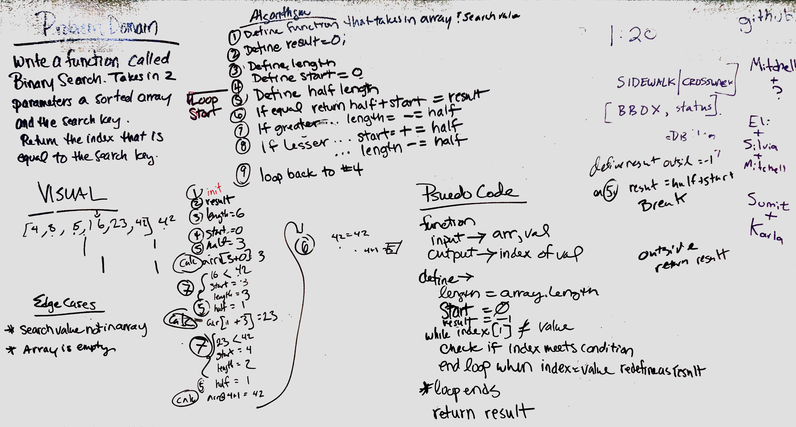

# Array Binary Search challenge

[PRRequest](https://github.com/abferris/data-structures-and-algorithms/pull/26)
[TravisTests](https://travis-ci.com/abferris/data-structures-and-algorithms)
[JSDocs]: not quite done yet

Code Challenge - 03
March 18, 2019
## Challenge
Given the input of a sorted array, and a key value, search through the array for the value using the binary sort method.
Return idx of result or -1
## Approach and Efficiency
* First define a result and start as -1. 
* Define length as the length of the array.
* Initiate while loop condition length>0
  * Define half to be half of length
  * Using array @ idx of half
    * if it equals key value result
      * result equals half+start
      * Break loop
    * if it is greater
      * length -= half
      * Back to loop start
    * if it is lesser
      * start += half
      * length -= half
      * back to loop start
* return result

## Solution

## Tests:
 - [ ] Finds value in bottom half
 - [ ] Finds Value in top half
 - [ ] returns -1 if value is not in array

### Tests and code Not written due to lab time constraints

Completed whiteboard with Erin Trainor

