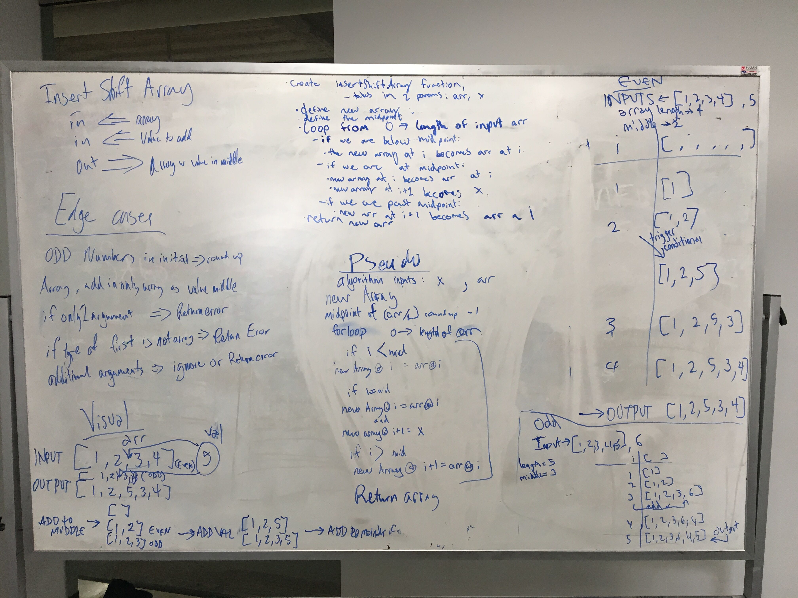

# Array Shift Code challenge

Code Challenge - 02
March 18, 2019
## Challenge
The challenge is to insert a input into the center of an array without using built in methods.

## Approach and Efficiency
We ran through the array with a for loop, and use 3 if statements in order to decide if you were before in the middle or after the center. Once you hit the center you add in the first value, then the second value, and after you insert at position i+1

I belive that the efficiency should be O(n), but we haven't gone through it

## Solution

Completed whiteboard with Chris Merritt and Joseph Wolfe

