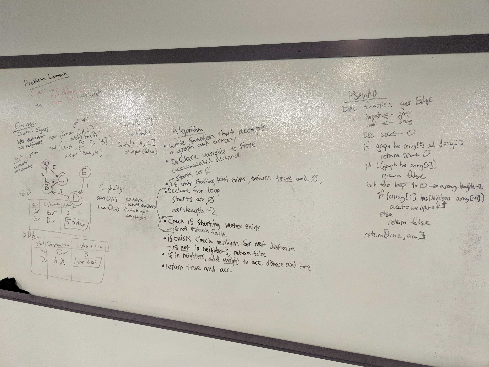

# CODE CHALLENEGE 32: Graphs - Get edges
April May 5, 2019
Author: Aaron Ferris    
  
[pull request](https://github.com/abferris/data-structures-and-algorithms/pull/59)  
[Travis](https://travis-ci.com/abferris/data-structures-and-algorithms)
[Folder wit hash table content](https://github.com/abferris/data-structures-and-algorithms/graphs/getEdges/)

## Challenge
The given map represents cities, the flight paths between them, and the price of their flight, return the price of a trip specified by an array

## Approach & Efficiency
* map simulates all flights between citie
* edge simulates flight
* edge weight simulates price
* the itinerary given is an array of stops.
* if two positions next to each other are not connected the trip cannot happen and therefore must be false
* the weights can be added up to make up the overall price

### Steps and algo
* can be seen in my notes
* this is made to be a function on a graph will need to require in the graph and the methods on the graph that exist

  
  

### Tests: 
#### getEdges function 
    ✓ will return true with a price of 0 for a single node input (4ms)  
    ✓ willreturn the weight between 2 nodes if two connected nodes are presented (1ms)  
    ✓ will return the accumulated weights between connected nodes  
    ✓ will return false for 2 disconnected nodes (1ms)  
    ✓ will return false for 3 or more nodes with one disconnected  
    ✓ will return false for an input that is not in the graph  
