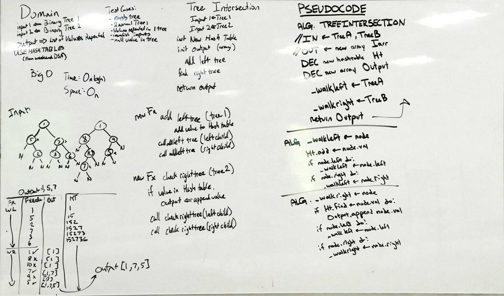

# Code Challenge: Tree Intersection
## DSA Hash tables
April 30, 2019

[pull request](https://github.com/abferris/data-structures-and-algorithms/pull/54 )  
[Travis](https://travis-ci.com/abferris/data-structures-and-algorithms)
## Challenge:
* Create a method 
  * Takes in two trees
  * Finds repeat values in tree
  * returns An array of repeated words

## Tests
[ ] it will return null if one tree is empty  
[ ] will return normal values overlapping in 2 trees  
[ ] will work with one tree repeating values within it  
[ ] will reject invalid inputs
[ ] will work with a null value in tree  
* Note due to timeliness I have not done the tests.

### Approach 
* Use weekend DSA Hash table class
* Use DSA Tree Class in testing
* create a hash table
* Iterate through the left tree recursively
  * Preorder
  * in preorder place, add the value to hashtable
* Iterate through the left tree recursively
  * Preorder
  * in preorder place, check table for value, and if it's there push it into a results array.

* Below are the whiteboards planning how to do this.

