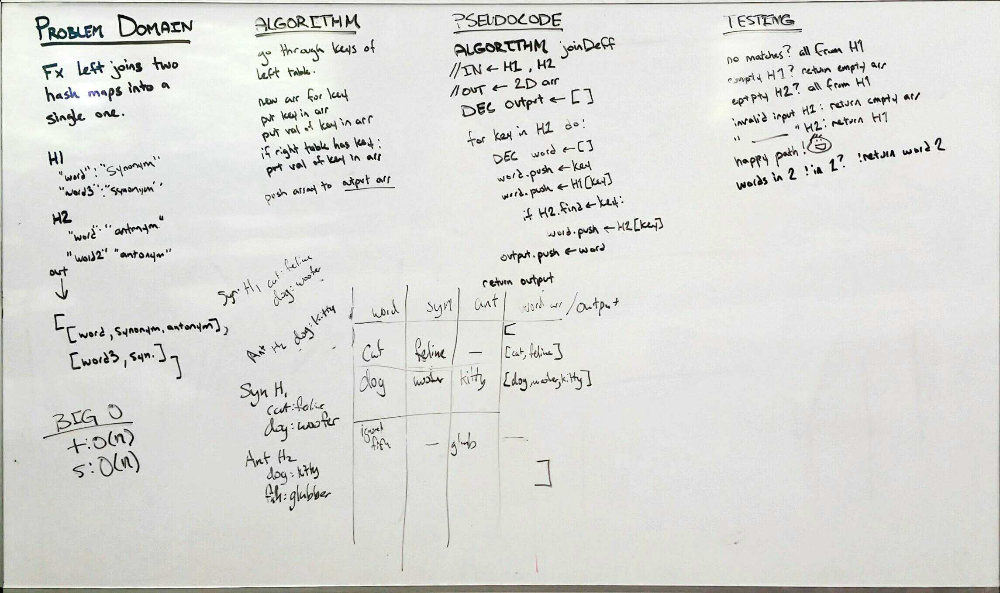

# CODE CHALLENGE: LEFT JOIN  
Week DSA: Hashtables  
May 1, 2019  
Author: Aaron Ferris  
  
[pull request](https://github.com/abferris/data-structures-and-algorithms/pull/55)  
[Travis](https://travis-ci.com/abferris/data-structures-and-algorithms)
[Folder with Left Join Content](https://github.com/abferris/data-structures-and-algorithms/tree/master/hashtable/leftJoin)

## Challenge:
* Create a method 
  * Takes in two hash tables
  * ouputs values as left join method works
    * output is an array
    * tree 1 will have all values in the output array
    * where tree 2 has keys that match tree 1, the key's values are added to the output array's tree
  * concerns with testing:
    * standard path: a few overlapping values
    * empty hash table 1 (return empty array)
    * empty hash table 2 (only values from hash table 2)
    * invalid inputs of h1, (return empty array)
    * invalid inputs of h2, (return h1 array)
    * no matches (return empty array)
    * if words in 2 are not in 1, they aren't in the array
    * if the words in 1 are not in 2, no secondary pair

## Tests
[ ] it will return values from table 1 and table 2 together  
[ ] it will return an empty array with  an empty hash table 1 
[ ] it will return only values from hash table 2 with empty hash table 2 
[ ] it will return return empty array with invalid inputs of h1
[ ] it will return return h1 array with invalid inputs of h2, 
[ ] it will return an empty array with no matches 
[ ] it will return if words in 2 are not in 1, they aren't in the array
[ ] it will return if the words in 1 are not in 2, no secondary pair

### Approach 
* create an output array
* go through the keys of the left table
* for every key in h1
  * create  word array
  * push key from hash table 1 into word array
  * push key's value into word array
  * if key exists in  hash table 2
    * push it's value into the word array
  * push word array into output array
* return output array
  
* Below are the whiteboards planning how to do this.

