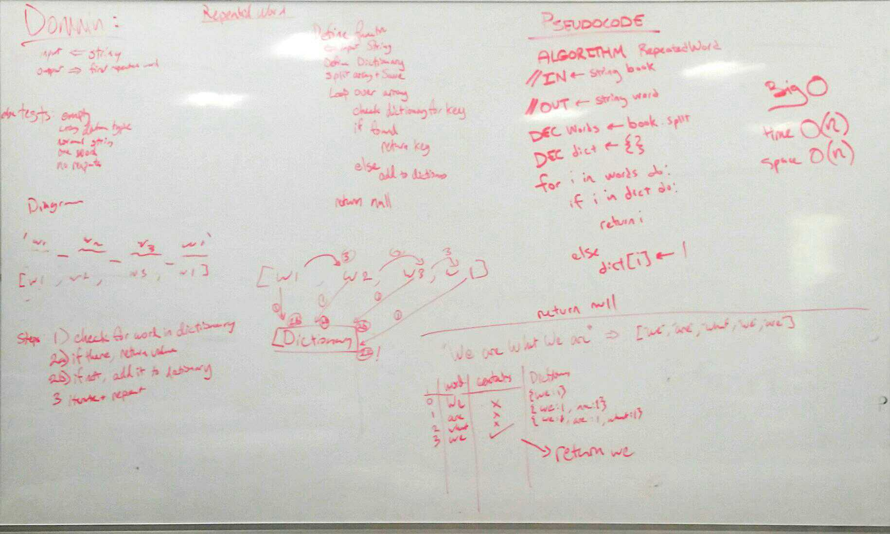

# Code Challenge Repeat words
## DSA Hash tables
April 29, 2019

[pull request](https://github.com/abferris/data-structures-and-algorithms/pull/53 )  
[Travis](https://travis-ci.com/abferris/data-structures-and-algorithms)
## Challenge:
* Create a method 
  * Takes in string
  * Finds repeat words in string
  * returns repeat words in string

## Tests
[x] It will successfully return a repeated word
[x] It will return the first repeated word in a string
[x] It will return for two of the same word differently capitolized
[x] It will return a repeated word adjacent to punctuation
[x] It will return null if no repeated word
[x] It will return null for an incorrect input
[x] It will return null for an empty input
[x] It will return null for a single input

### Approach 
* Use weekend DSA Hash table class
* Split the string with regex
* Create a dictionary/hash table 

* Below are the whiteboards planning how to do this.

