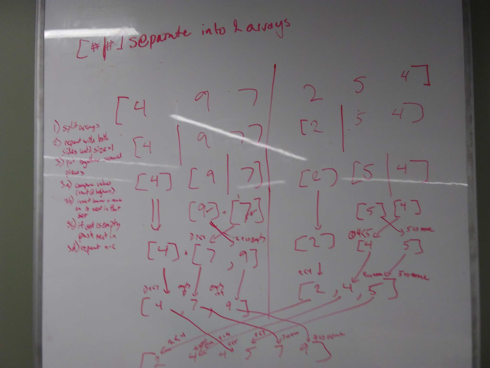

# Lecture Notes: Merge Sort
  
* Merge sort: 
  * A quick an efficent way to sort a lot of data for time.   
  * Better with time, worse with space.   
  * Typically used with sort from scratch.  
  * Insertion sort may be used for adding extra data points, or smaller sets of data.  
  * Breaks the problem up into smaller parts and deals with unsorted smaller parts first

## Learning Objectives
* What are sorts?
* How will we use them?
* When do we use merge sort 
* Quick intro to recursion
* How does merge sort work?
* Today

## Lecture Flow

1) sorts:   
* sorting data is a critical part of our job
* definition of a sort
* different sorts for every situation
  * ask them about types of sorts (insertion)
  * if you have time run # 2
2) HAVE A STUDENT BE A COMPUTER  
* ask for a volunteer
* have volunteer sort an array on a whiteboard of sticky notes
  * They can only use one hand at a time
  * They can only compare 2 things at a time
  * 2 things can not be in one place at a time
* when a student makes a decision to look at a particular item, ask why?
  * if they say because it is the smallest, ask what they would have to do as a computer to deterimine it.
  * what do they have to compare
  * how many times do they have to compare
* if they have trouble doing it their way, ask for suggestions from audience for how to
* if they continue to have trouble  walk them through the closest type of sort they are to
  * this will usually be insertion sort. if you're not sure default back to this
3) merge sort 
* good for larger sets of data
* efficient for time
* takes up a lot of space, however space is cheaper than time now with technology
* conquer and divide
  * what do we do with huge problems?
    * break it up into smaller problems  
  * easier to sort smaller pieces than larger pieces
  * when we get to larger pieces, if they are already sorted, we are able to handle them easier.
* commonly done with recursion
  * what is recursion?
    * calls itself within the function    
    * can use up less time than loops depending on situation
    * call stack refresher(talked about in 201)  
      * when you call the function inside of itself, the rest of the function is put on hold until the calling of itself is resolved
      * after it returns to finish the rest of it.
* quick algorithm step through
  * draw it out
  * steps: 
    * if length of array is greater than 1  
      * split into left half and right half
      * run recursively on left half
      * run recursively on right half
      * sort the parts by comparing the fronts (recursively calling)
    * return the sorted arrays  
  * will need to run through the putting back together of the array every time
    * compare front of left and right side  
      * push whichever is to output
      * move to next value on whichever you pushed
      * compare values if there
      * if one is empty, push the remnants of the other to array
* write out algorithm steps if they seem understanding
  * try to ask them what steps it would be
## Diagram

[Visual](https://www.c-programming-simple-steps.com/images/merge-sort-visual.png)

## Algorithm

* mergesort is a function 
  * array is input
  * save the length
  * if the length is greater than 1
    * mid is of length rounded down
    * part1 is array from beginning to mid
    * part2 is array from mid to end
    * call mergesort with part1 as input
    * call mergesort with part2 is input
    * use a helper function to merge b and c as modification to array
  * return array 
  
* helper function sort
  * takes in 2 arrays to merge and destination array as input
  * set a counter i for first array
  * set a counter j for second array
  * set a counter k for destination array
  * while both i and j are less than the length of their respective arrays
    * if array1 at i is less than array2 at j
      * put array1 at i into destination array
      * iterate i
    * if array1 at i is greater than array2 at j
      * put array2 at j into destination array
      * iterate j
    * iterate k
  * whichever array finishes first push the rest of the other into what is left of destination array
  * return output array

   

## Pseudocode

* mergeSort <= (arr)
  * init L = arr.length
  * if L>1
    * init mid = L/2 (floor)
    * init halfOne = arr[0] => arr[mid]
    * init halfTwo = arr[mid=1] => arr[arr.length-1])
    * mergeSort(halfOne)
    * mergeSort(halfTwo)
    * merge(halfOne, halfTwo,arr)
  
  return arr
  
* merge <= (a,b,out)  
  * init i = 0  
  * init j = 0  
  * init k = 0  
  * while i < a.length && j < b.length  
    * if a[i] < b[j]   
      * out[k] = a[i]   
      * i iterates   
    * else    
      * out[k] = b[j]  
      * j iterates  
    * k iterates     
  * if i === a length   
    * while j < b length  
      * out[k] = b[j]  
      * k iterates     
      * j iterates     
  * if j === b.length   
    * while i<a length   
      * out[k] = a[i]  
      * k iterates     
      * i iterates     
  * return out  
  

## Readings and References

**Watch**

* [Hacker Rank Merge Sort Video](https://www.youtube.com/watch?v=KF2j-9iSf4Q)

**Read**

* [C Programming on Merge Sort](https://www.c-programming-simple-steps.com/merge-sort.html)
* [Geeks4Geeks on Merge Sort](https://www.geeksforgeeks.org/merge-sort/)
* [Recursion Refresher](https://medium.freecodecamp.org/how-recursion-works-explained-with-flowcharts-and-a-video-de61f40cb7f9)

**Bookmark**

* [Sorting Algorithms for Dayz](https://www.geeksforgeeks.org/sorting-algorithms/)

**Diagram**
* [Visual](https://www.c-programming-simple-steps.com/images/merge-sort-visual.png)  
pulled from https://www.c-programming-simple-steps.com/
* 
