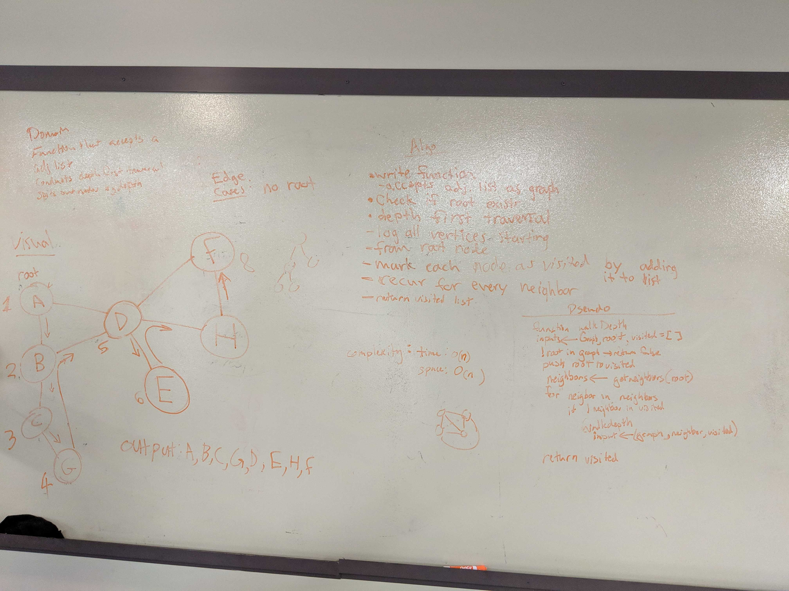

# Code Challenge 33: Graphs Breadth First Traversal
April May 6, 2019
Author: Aaron Ferris   
Whiteboard with: Aaron Bruce
  
[pull request](https://github.com/abferris/data-structures-and-algorithms/pull/59)  
[Travis](https://travis-ci.com/abferris/data-structures-and-algorithms)
[Folder wit hash table content](https://github.com/abferris/data-structures-and-algorithms/graphs/depth/)

## Challenge
Traverse a graph Breadth first

## Approach & Efficiency
* Use the weekend adjacently list to represent the graph
* use recursion to travel to nodes
* takes in root node name and an output array that is predefined as empty
* push to your visited array the root value
*  get your root's neighbors and iterate over them
* if you haven't been there, call the fucntion on each neighbor using the visited array
* return visited

### Steps and algo
* can be seen in my whiteboard
* Whiteboard with Andrew Curtis

### Tests: 
#### Breadth first method
  * ✓ will traverse a large tree breath first (6ms)
  * ✓ will traverse a graph of one node
  * ✓ will deal with a self link in a graph (1ms)
  * ✓ will not walk to a disconnected node from the starting point
  * ✓ will traverse a graph of one node
