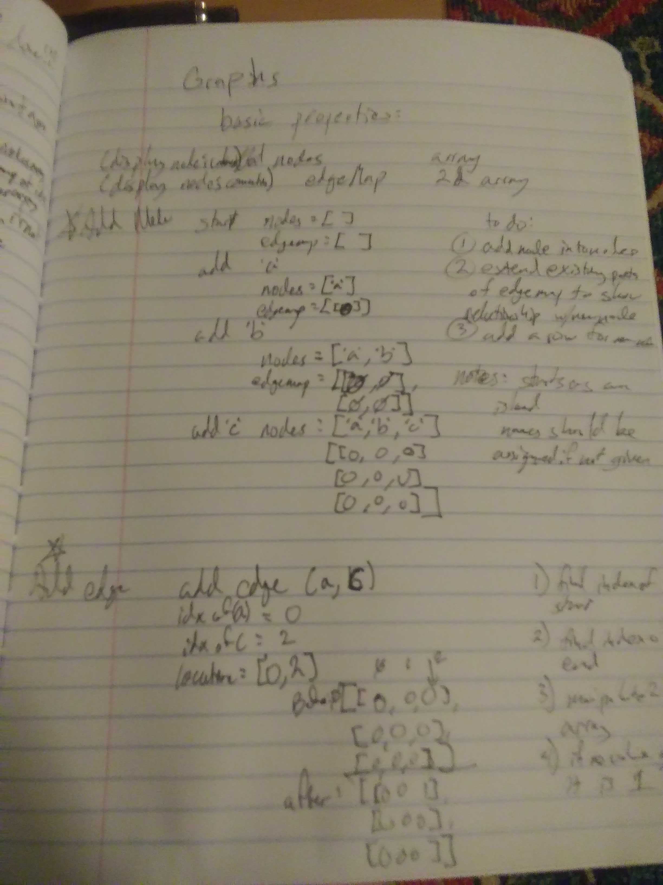
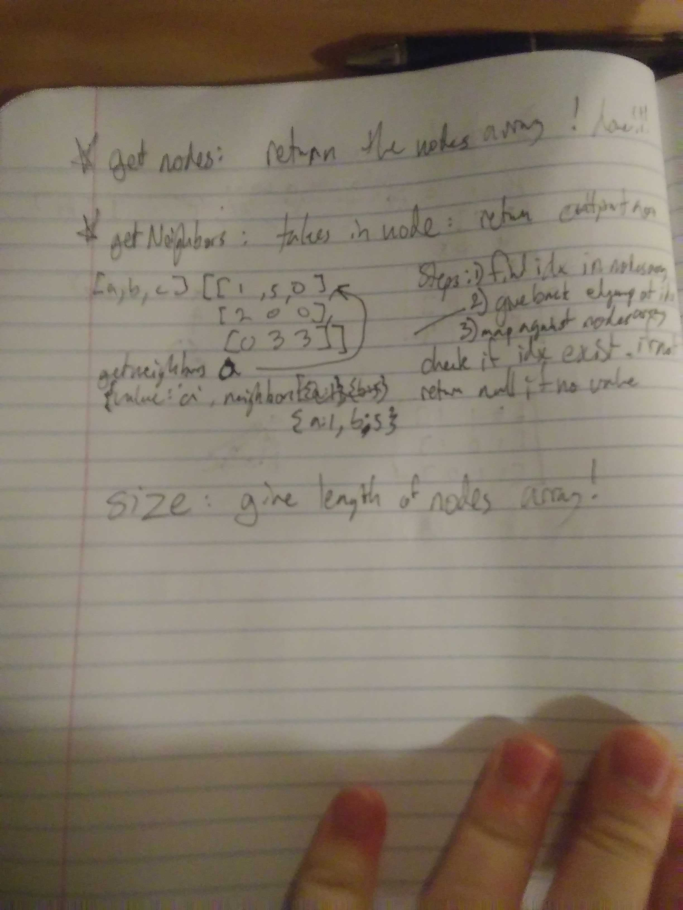

# DSA: Graphs
April May 5, 2019
Author: Aaron Ferris    
  
[pull request](https://github.com/abferris/data-structures-and-algorithms/pull/57)  
[Travis](https://travis-ci.com/abferris/data-structures-and-algorithms)
[Folder wit hash table content](https://github.com/abferris/data-structures-and-algorithms/graphs/graphbase/)

## RESUBMIT INFORMATION
* I created the initial graph representation as a adjacency matrix instead of an adjacency list. I have remedied this.
* The approach was to follow the data structure as follows:
  * The graph should have a list of nodes `(graph.nodes)`
  * this list of nodes should be accessable by their value `graph.nodes[value]`
  * those nodes should have a value property and an array of their connections`graph.nodes[value].val/connections`
  * those node connections should list the connections and their weight `graph.nodes[value].connections[connection]= weight`

## Challenge
Create a Graph base
## Approach & Efficiency
* I followed the idea behind graph adjacency table, using a 2d array.  
* The object has a list of nodes and an array of connections

### Steps and algo
* can be seen in my notes
* Graph notes for addNode and addEdge
  
  
* Graph notes for getNodes, GetNeighbors and size

### Tests: 
#### Matrix Representational Graph function  
    ✓ will create a graph (6ms)  
  Graphs addNode function  
    ✓ will add a node to an empty graph (1ms)  
    ✓ will add a node with a name to a not-empty graph (1ms)  
    ✓ will name and add a node if no name is specified  
  Graphs addEdge function  
    ✓ will add an edge with a weight (1ms)  
    ✓ will add an edge without a weight (1ms)  
    ✓ will return null trying to add an impossible edge  
  Graphs getNodes function  
    ✓ will return the nodes  (1ms)  
  Graphs getNeighbors function  
    ✓ will return an array of connections for a valid input  
    ✓ will return null for an invalid input (1ms)  
  Graphs size function  
    ✓ will return a graphs size

#### List Representational Graph Testing:  
  Graph function  
    ✓ will create a graph (9ms)  
  Graphs addNode function  
    ✓ will add a node to an empty graph (3ms)  
    ✓ will add a node with a name to a not-empty graph (1ms)  
    ✓ will return null if no name is specified (1ms)  
  Graphs addEdge function  
    ✓ will add an edge with a weight (2ms)  
    ✓ will add a second edge with a weight (1ms)  
    ✓ will add an edge without a weight (1ms)  
    ✓ will return null trying to add an impossible edge    
  Graphs getNodes function    
    ✓ will return the nodes  (1ms)  
  Graphs getNeighbors function    
    ✓ will return an array of connections for a valid input (1ms)    
    ✓ will return null for an invalid input (1ms)    
  Graph`s size function  
