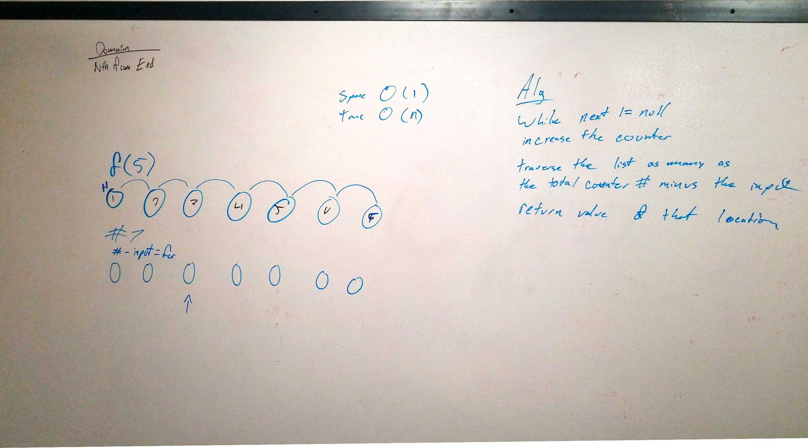

# DSA LINKED LIST
DSA 1: linked list
March 24, 2019

[pull request]()
## Challenge
The challenge is to create a linked list, add a method to add values to it, add a method to search for a value, and a method to print the value

## Approach 
### LL challenge 01
Create a class for linked list with a propety head: null.  

subsequent added nodes reference a node class with a value and a next  

 first have their next set to the head of the linked list, then define the head of the linked list as the node.  

 You end up with what is basically nested objects (object-ception if you will)  

your search function will set a value of current to start as head. while current has a value that is not null, run the following. if current's value = input return true, otherwise  set current to equal current.next  

your print function should start with a variable current at the head. while current exists (is not null) document it. output starts as an empty array, or a string This could be done by adding it to a output or simply logging the console.  
### ll challenge 02
With the Insertion funnction, set the new node's value equal to the head and then the object's head to the new node.  

For insertion at the end, iterate through the loop. Once next is equal to node, make a new node and set it's to equal the next of your current position.  

For insertion at a certain point, iterate through the loop using a counter to hit I. Once you hit the certain value. then set a node's next to equal the current next, and then the current's next to equal the node. if you do it before, use a less than, if you do it after, do less than or equal to.  

### ll challenge 03

To insert a value k values away from the end, iterate from the head for k values with a variable called frontrunner. Once you hit k, set a variable backrunner equal to the head, and iterate them at the same time. ONce frontrunner hits null, return the val of the current node of backrunner.
(NOTE: my psuedo code)  

### Tests
#### Challenge 1
[x] Can successfully instantiate an empty linked list  
[x] Can properly insert into the linked list  
[x] The head property will properly point to the first node in the linked list  
[x] Can properly insert multiple nodes into the linked list  
[x] Will return true when finding a value within the linked list that exists  
[x] Will return false when searching for a value in the linked list that does not exist  
[x] Can properly return a collection of all the values that exist in the linked list  

#### Challenge 2
[x] Can successfully add a node to the end of the linked list  
[x] Can successfully add multiple nodes to the end of a linked list  
[x] Can successfully insert a node before a node located i the middle of a linked list  
[x] Can successfully insert a node before the first node of a linked list  
[x] Can successfully insert after a node in the middle of the linked list  
[x] Can successfully insert a node after the last node of the linked list 

#### Challenge 3
[x]Where k is greater than the length of the linked list  
[x] Where k is not a positive integer  
[x] Where the length of the list is equal to k  
[x] Where the linked list is of a size 1   
[x] Can successfully add a node to the end of the linked list  
[x] “Happy Path” where k is not at the end, but somewhere in the middle of the linked list Can successfully add a node to the end of the linked list  

#### Challenge 4

[x]Same length  
[x] A < B  
[x] B > A  
[x] One of the inputs has no length  

