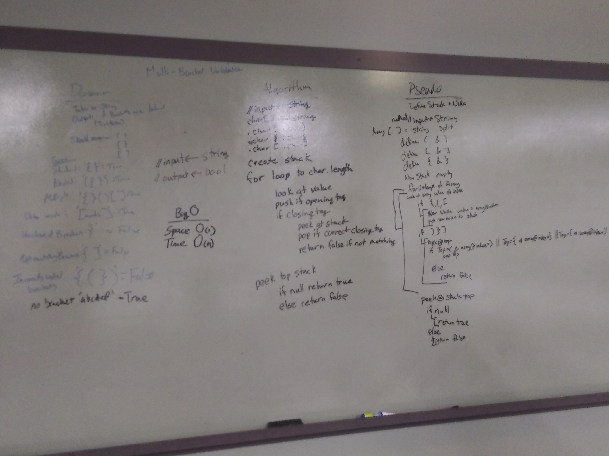

# DSA Bracket Validation
DSA 2: Stacks and Queues
April 3, 2019

[pull request](https://github.com/abferris/data-structures-and-algorithms/pull/41)  
[Travis](https://travis-ci.com/abferris/data-structures-and-algorithms)
## Challenge 1

* Create A function
  * Input is a string
  * Output is Boolean
  * If the string has all of its opening and closing tags created properly, return true
    * single bracket: `()`
    * multiple brackets: `() {}[]`
    * nested brackets: `{()}`
    * with contents: `(words)`
    * no brackets `words`
  * if tags are improperly created return false
    * unclosed opening brackets: `{`
    * unclosed closing brackets: `]`
    * closed with wrong bracket: `{]`
    * offset brackets: `[(])`

## Approach 
* Below are the whiteboards planning how to do this.
* Stack and node are copied from the stacks and queues challenge

### Tests  
#### Happy Path @:^)
[x]single bracket: `()`
[x]multiple brackets: `() {}[]`
[x]nested brackets: `{()}`
[x]with contents: `(words)`
[x]no brackets `words`
#### Unhappy Path TT_TT
[x]unclosed opening brackets: `{`
[x]unclosed closing brackets: `]`
[x]closed with wrong bracket: `{]`
[x]offset brackets: `[(])`
