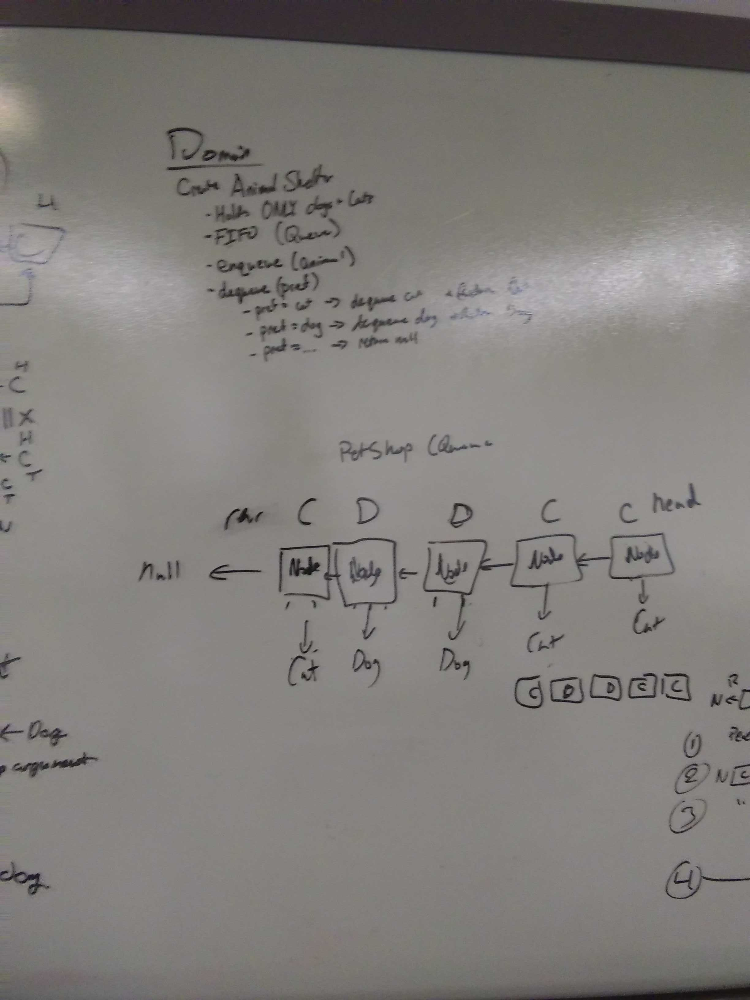
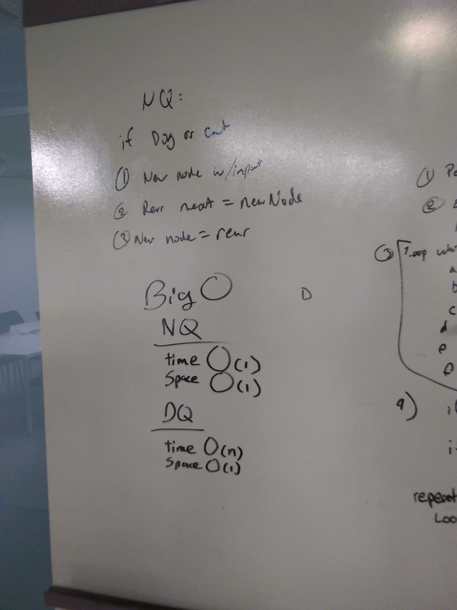
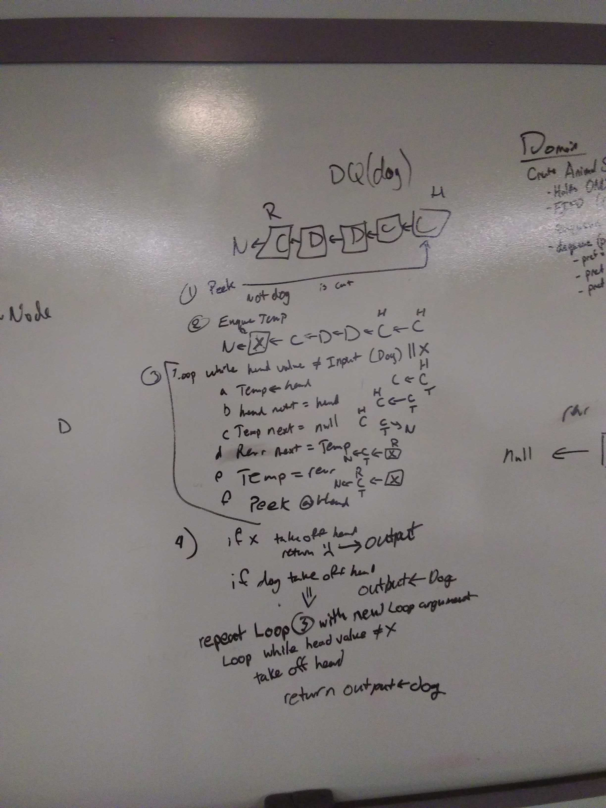

# DSA PetShelter
DSA 2: Stacks and Queues
March 30, 2019

[pull request](https://github.com/abferris/data-structures-and-algorithms/pull/40)  
[Travis](https://travis-ci.com/abferris/data-structures-and-algorithms)
## Challenge 1

* Create an Animal Shelter.
  * it can enqueue
  * Enqueues from tail or rear
  * it can dequeue
  * dequeue takes an input and looks for the type of animal that matches the input, and takes out the one closest to the head

## Approach 
* Below are the whiteboards planning how to do this.
  * Note: clouds are the class. Arrows are properties, and boxes are nodes. If an arrow is unlabeled, it is a next property. Each step shows exactly what is happening.

### Tests
#### Challenge 1  
##### PetShelter
[x] Can initiate with cat or dog  
[x] Can successfully enqueue a cat   
[x] Can successfully enqueue a dog  
[x] Can successfully enqueue a cat  
[x] Will not enqueue enqueue an animal that isnt a cat or a dog  
[X] Will return null dequeing proper input  
[X] Can dequeue from head   
[x] Can dequeue from further back  

