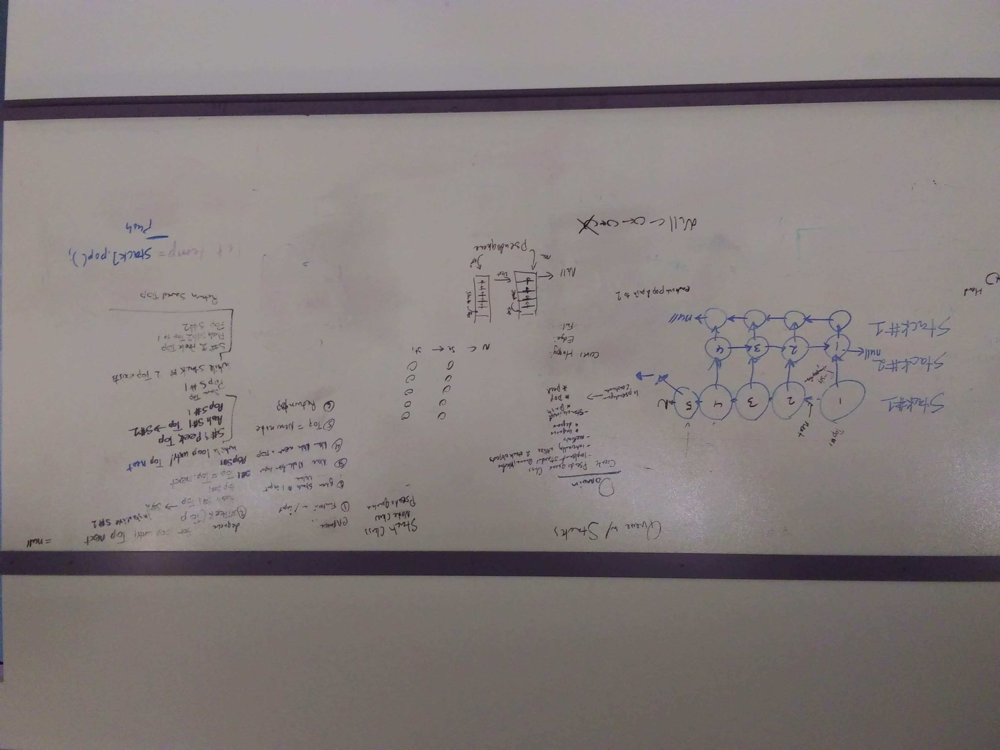
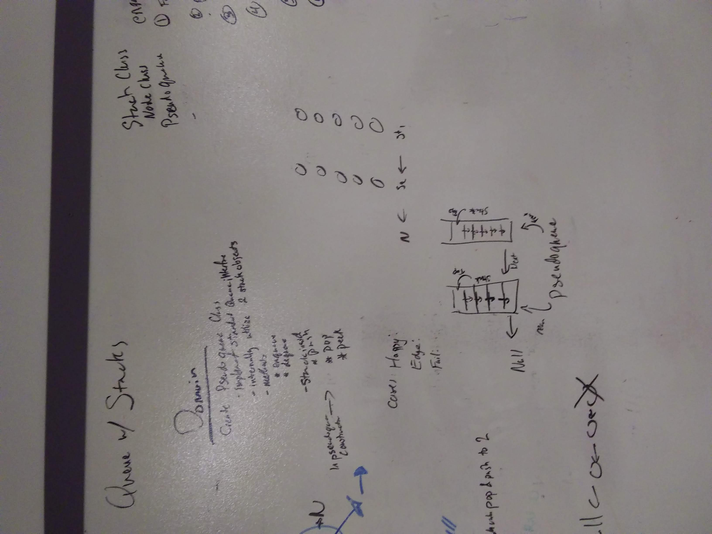
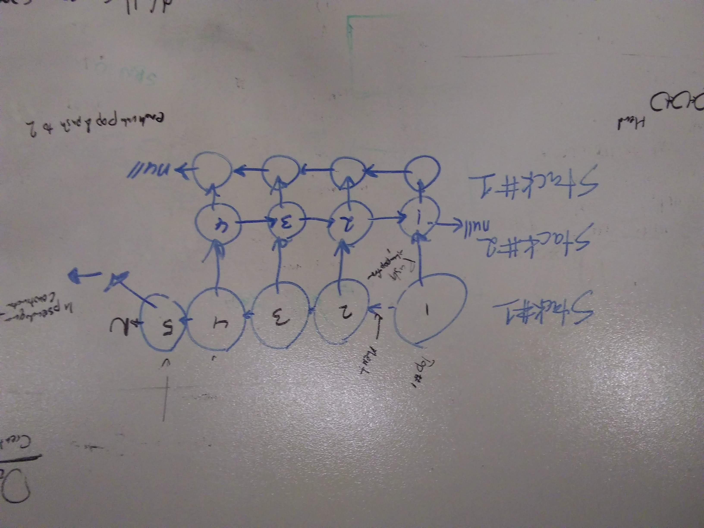

# DSA Stacks and Queues
DSA 2: Stacks and Queues
April 1, 2019

[pull request](https://github.com/abferris/data-structures-and-algorithms/pull/39)
[travis](https://travis-ci.com/abferris/data-structures-and-algorithms)
## Challenge 1

* Create queue-like functions of a stack
  * Use stack to create:
    * Should be able to enqueue
    * Should be able to dequeue

## Approach 
* Below are the whiteboards planning how to do this.
  * Note: clouds are the class. Arrows are properties, and boxes are nodes. If an arrow is unlabeled, it is a next property. Each step shows exactly what is happening.
* Queues

* domain

* visual

* algo

### Tests
#### Challenge 2  
##### enqueue
[x] Can successfully enqueue onto an empty stack  
[X] Can successfully enqueue multiple nodes onto a stack  

##### dequeue  
[x] Can successfully dequeue a value from a queue  
[x] Can successfully dequeue multiple values
[x] Will return null when trying to dequeue an emptey pseudoqueue

