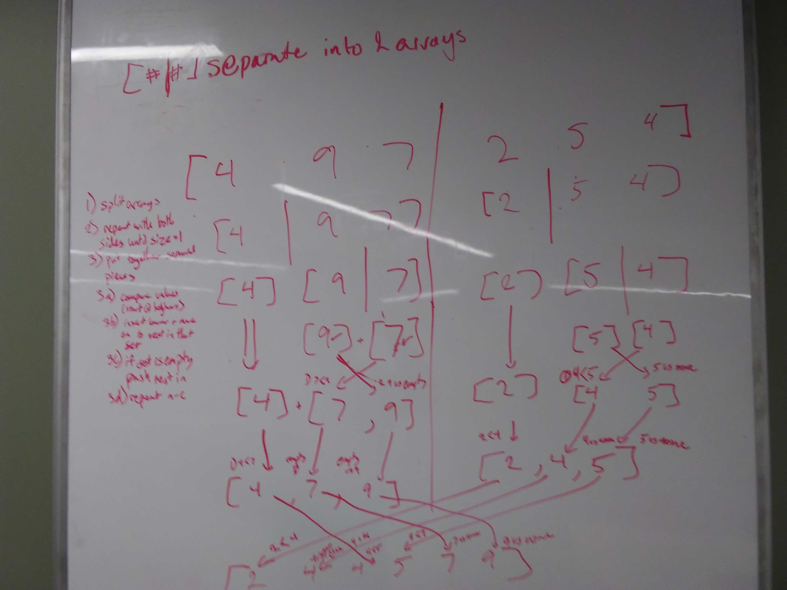

# Code Challenge 26: Merge Sort 
DSA: Sort  
April 22, 2019  
Author: Aaron Ferris  
  
[pull request](https://github.com/abferris/data-structures-and-algorithms/pull/49)  
[Travis](https://travis-ci.com/abferris/data-structures-and-algorithms)

## Challenge
Create a funciton that executes a merge-sort

## Approach & Efficiency
My approach very closely followed what was given to us by the explanation referenced below.  

### Steps
* split apart arrays into 2 separate parts until you get units of one.
* while array is greater than 1 in length
  * rerun the function on the left half
  * rerun the function on the right half
  * use a helper function to put them back together in order
    * iterate through array. 
    * compare front values of left and right half. Add whichever is lower to the output array, and move to the next value in that array and compare it to the same on the other half.
    * continue until one of the arrays is empty.
    * add the rest of the other array to the output
* return the final result
  
  
The way this is called will result in  dealing with array with a length of 1 first, and then building it up.

### Example
steps: 
a) split into 2 parts  
b) run function on first half  
c) run function on second half  
d) merge 2 parts  
return 
* Number which level of recursion  
* Letter signifies which step
Example:  
[1,2,3,4,5,6,7]  
split into 2 parts  
[5,3,6 | 4,2,7,1]  => [5,3,6] | [4,2,7,1]  
separate left half  
[5 | 3,6] [4,52,7,1] => [5] | [3,6] | [4,2,7,1]
left half is single, go back up and do split for right half of two  
[5] | [3,6] | [4,2,7,1] => [5] | [3] [6] | [4,2,7,1]
put right half back together in order  
[5] | [3] [6] | [4,2,7,1] => [5] | [3,6] | [4,2,7,1]  
  put left half together with right half
[5] | [3,6] =>  [5] [6]... [3]
[5] [6]... [3] => [6]... [3,5]
[6]... [3,5] => [3,5,6]
[3,5,6] | [4,2,7,1]
start on spliting right half for part 1  
[3,5,6] | [4,2 | 7,1] => [3,5,6] | [4,2] [7,1]  
do it again for the left part of that  half  
[3,5,6] | [4 | 2] [7,1] => [3,5,6] | [4] [2] | [7,1]    
put them back together in order  
[3,5,6] | [4] [2] | [7,1] =>  [3,5,6] | [2,4] | [7,1]  
split apart the right side of the two  
[3,5,6] | [2,4] | [7 | 1] => [3,5,6] | [2,4] | [7] [1]  
puth them back together in order  
[3,5,6] | [2,4] | [7] [1] => [3,5,6] | [2,4] [1,7]  
put those together  
[2,4] [1,7]  
one is less than two  
[2,4] [7]... [1]  
two is less than four  
[4] [7]... [1,2]  
four is less than seven  
[7]... [1,2,4]  
seven has no opposing number  
[1,2,4,7]  
final  
[3,5,6] [1,2,4,7]  
put back together the two sides
[3,5,6] [1,2,4,7]  
one is less than three  
[3,5,6] [2,4,7] ... [1]  
two is less than three  
[3,5,6] [4,7] ... [1,2]  
three is less than four  
[5,6] [4,7] ... [1,2,3]  
four is less than five  
[5,6] [7] ... [1,2,3,4]
five is less than seven  
[6] [7] ... [1,2,3,4,5]  
six is less than seven  
[7] ... [1,2,3,4,5,6]  
seven is the last one left
[1,2,3,4,5,6,7]
return above array

The efficiency of space is O(1) and time is O(n^2)
Insertion sort background and starter information given by codefellows.  
[Insertion Sort Explanation](https://codefellows.github.io/common_curriculum/data_structures_and_algorithms/Code_401/class-35/resources/InsertionSort)  

## Tests and completion
This function should have:  
[X] A randomly generated unsorted array returns the array sorted  
[X] A sorted array returns the same sorted array  
[X] A backwards-sorted array returns the array sorted  
[X] An empty array returns the same empty array  
[X] An array of one element returns the same single-element array